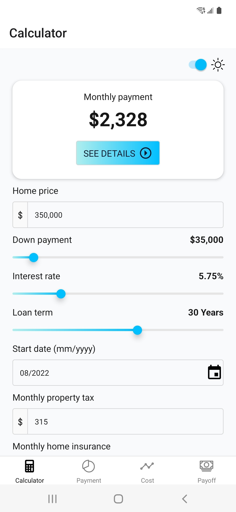
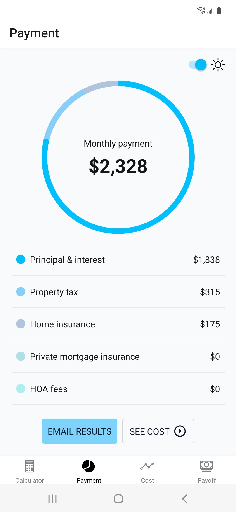
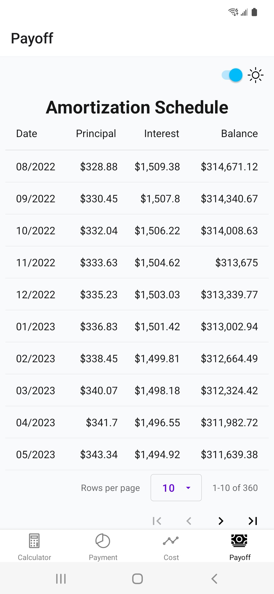

# Mortgage Calculator App

The Mortgage Calculator App is a portfolio project that I created to assist potential home buyers to calculate their monthly mortgage payment based on home loan details such as, home price, down payment, interest rate, loan term and other factors. In addition to the monthly payment breakdown, the mobile app also calculates the total interest paid over the lifetime of the loan and the amortization schedule. The home loan amortization data is displayed both as a line chart and in tabular format, providing detailed information regarding each scheduled payment. The app is responsively designed for all device types and is available via the Google Play store as [Mortgage Calculator](https://play.google.com/store/apps/details?id=com.codesciousness.mortgagepaymentcalculatorapp).

## Table of Contents

- [Features](#features)
- [Technologies](#technologies)
- [Screenshots](#screenshots)
- [Future Work](#future_work)
- [Status](#status)

## Features

### Client-side Features
The client side of the mobile app was built with Expo, NativeBase, React, React Native, React Redux, and TypeScript, and includes the following features:

- A calculator input screen to enter relevant home loan information such as the home price, down payment, interest rate, loan term, start date, etc.
- A payment screen with a donut chart and legend to display the proportions of the monthly payment that pertain to principal and interest, property tax, homeowner's insurance, etc.
- A cost screen to display details such as the loan amount, total interest paid, total cost of the loan and the payoff date.
- An interactive line chart on the cost screen, which shows the accumulation of the principal paid, the interest paid and the remaining balance over time.
- A payoff screen containing an amortization schedule table, which shows the date, amount of principal, amount of interest and the loan balance remaining for each of the total number of scheduled payments.
- There is an email form modal to enter a name and email address to have the monthly payment summary and loan totals delivered by email.
- Additionally, AdMob interstitial ads have been integrated into the app, when the user navigates to the payment screen to see the monthly payment summary.

### Server-side Features
The server side of the project was created with Firebase Functions, Node.js, Express and TypeScript and includes the following features:

- Data validation and sanitization functions utilized to check form input data, along with error feedback from the server to pinpoint the issue.
- A Firebase api function for processing new loan POST requests sent from the client and saving them to the firestore database or updating an already saved loan.
- A Firebase sendEmail function trigger to insert the loan values into a simple html email template and send an email utilizing the Nodemailer module.
- A general Firebase Functions rate limiter for the mobile app to limit the number of requests per IP address during a 15 second time frame.

## Technologies

Frontend:

- Expo: 46.0.0
- Expo Dev Client: 1.2.1
- Expo Linear Gradient: 11.4.0
- Expo Status Bar: 1.4.0
- Expo Updates: 0.14.5
- Native Base: 3.4.0
- React: 18.0.0
- React Native: 0.69.5
- React Native Dotenv: 3.3.1
- React Native Gifted Charts: 1.2.41
- React Native Google Mobile Ads: 7.0.1
- React Native Paper: 4.12.4
- React Native Responsive Dimensions: 3.1.1
- React Navigation Bottom Tabs: 6.3.2
- React Navigation Native: 6.0.11
- React Redux: 8.0.2
- Redux Toolkit: 1.8.3
- Sentry Expo: 5.0.0
- Sentry React Native: 4.2.2
- TypeScript: 4.6.3

Backend:

- Body Parser: 1.20.0
- Cors: 2.8.5
- Dotenv: 16.0.1
- Express: 4.18.1
- Firebase Admin: 10.0.2
- Firebase Functions: 3.23.0
- Firebase Functions Rate Limiter: 3.9.1
- Node: 16.14.0
- Nodemailer: 6.7.8
- Number to Locale String Polyfill: 1.0.9
- TypeScript: 4.5.4
- Uuid: 8.3.2
- Validator: 13.7.0

## Screenshots

## Future Work

None scheduled.

## Status

This project has been completed.